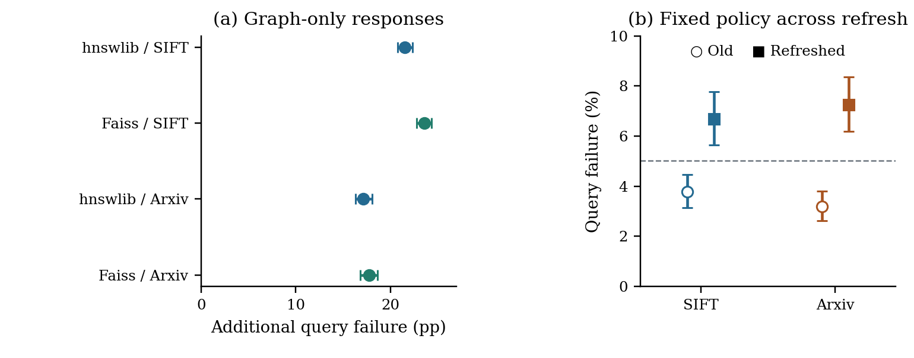
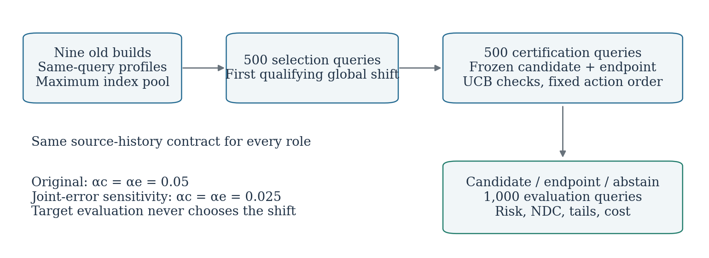

# ICBA: Auditing Search-Budget Portability Across Graph-ANNS Rebuilds

[](https://github.com/edwards365/navigation-aware-resistance-hnsw/actions/workflows/ci.yml)
[](https://www.python.org/)
[](LICENSE)
[](paper/sigmod2027/ICBA_SIGMOD_EA_FINAL_V3_PRIME.pdf)

**ICBA** is an evidence-first framework for deciding whether a search-budget policy can be reused after a graph ANN index is rebuilt. The repository contains the paper, compact evidence, target-certification protocols, recovery policies, replay tools, and the complete historical research trail.



## Why this project exists

Rebuilding an ANN index can change the graph even when the vectors, queries, and exact neighbors are unchanged. A budget that was safe on the old graph can therefore become unsafe or wasteful on the rebuilt graph.

ICBA treats reuse as a target-specific decision contract:

1. construct a candidate without using held-out target outcomes;
2. certify it on a reserved target role;
3. fall back when evidence is insufficient;
4. evaluate once on a disjoint role; and
5. account separately for serving savings and acquisition cost.

**Target-calibrated pooling (TCP)** is one recovery route for recurring profiled queries. It is not assumed to be universally best: ICBA selects the least complex target-qualified policy whose information cost is justified by held-out value.

## Headline evidence

All statements below are conditional on the registered build panels, action grids, query populations, and measurement settings documented in the paper.

| Question | Main observation |
|---|---|
| Do budgets transfer across rebuilds? | Transferred first-passing actions add **17.17--23.60 percentage points** of query failure above target-specific references on registered hnswlib/Faiss × SIFT-100K/Arxiv-Nomic-100K blocks. |
| Does data refresh matter? | After a **5% refresh**, a frozen recurring-query policy crosses the **5% risk limit** on both 100K datasets. |
| Can ICBA recover deployable value? | Target certification, fallback, and held-out evaluation distinguish unsafe efficiency from qualified savings. |
| What does TCP recover? | TCP reduces endpoint-relative distance work by **44.39%** and **29.86%**; its incremental value over target calibration with the same target-label budget is resolved on SIFT, not Arxiv-Nomic. |
| Does the result survive prospective testing? | A frozen candidate qualifies in all **112 fixed target decisions** under per-decision certificates and reduces measured wall time by **51.35%** and **30.13%** on one fixed CPU setting. |
| Are simple policies competitive? | Yes. A paired audit finds a certified fixed action competitive with the source one-rung candidate, while label-richer target-global calibration can deliver the largest measured savings. |

These are not universal portability failures, simultaneous campaign certificates, or absolute-SOTA claims. See the [results guide](docs/RESULTS_GUIDE.md) for the claim-to-evidence map and boundaries.

## Start here

| Goal | Entry point |
|---|---|
| Read the current manuscript | [Final V3 Prime PDF](paper/sigmod2027/ICBA_SIGMOD_EA_FINAL_V3_PRIME.pdf) |
| Understand the evidence chain | [Results guide](docs/RESULTS_GUIDE.md) |
| Verify the compact artifact | [Quickstart](docs/QUICKSTART.md) |
| Navigate the full repository | [Repository map](docs/REPOSITORY_MAP.md) |
| Inspect current project status | [Status](reports/STATUS.md) |
| Audit paper provenance | [Paper provenance](paper/sigmod2027/PROVENANCE.md) |

## Quick verification

Linux/macOS, from a clean checkout:

```bash
python -m venv .venv
source .venv/bin/activate
python -m pip install --upgrade pip
python -m pip install -e '.[test]'
bash artifacts/graph_anns_phase3_ea85/reproduce_smoke.sh
```

The lightweight smoke checks sealed inputs, parses phase decisions, verifies the query-role firewall, rebuilds the compact integration outputs, and runs focused tests. It does **not** download datasets, access reserved truth, or run the expensive ANN matrix.

To regenerate paper-facing tables from committed evidence:

```bash
bash artifacts/graph_anns_phase3_ea85/reproduce_tables.sh
```

For Windows, manuscript-only replay, native builds, and full external-data replay, use [docs/QUICKSTART.md](docs/QUICKSTART.md).

## Evidence layers

```text
Graph rebuild / refresh
        |
        v
Portability measurement -----> external methods, Vamana, Deep1M
        |
        v
ICBA contract: construct -> certify -> fallback -> evaluate -> account
        |
        +---- TCP for recurring profiled queries
        |
        +---- fixed-slack / fixed-action / target-global alternatives
        |
        v
Prospective target decisions + runtime + lifecycle break-even
```

The statistical unit, role split, certificate scope, and cost currency differ across layers. They must not be pooled into a single leaderboard number.

The registered TCP workflow makes the information boundary explicit: historical profiles construct a candidate, target roles certify it, and evaluation cannot change the chosen shift.



## Repository structure

```text
paper/sigmod2027/                 manuscript, figures, appendix, compact checks
artifacts/graph_anns_phase3_ea85/ reviewer-facing reproduction entry point
python/                           reusable Python package
scripts/                          experiment, replay, and analysis programs
configs/                          frozen experiment and dataset configurations
results/                          committed compact evidence and sealed outputs
figures/                          generated project figures
tests/                            Python and native validation
theory/                           definitions, proofs, and counterexamples
docs/                             quickstart, evidence guide, and research records
reports/                          current status and historical reports
```

The repository grew through many preregistered stages. Stage-specific directories are retained for provenance; the [repository map](docs/REPOSITORY_MAP.md) identifies the canonical entry points and historical material.

## Reproducibility levels

- **Paper replay:** validates the compact numerical package and regenerates manuscript tables/figures without raw ANN data.
- **Artifact smoke:** verifies checksums, decision logic, role isolation, and focused tests in about a minute.
- **Full replay:** reruns native analyses with checksummed external datasets and indexes; see [full replay instructions](artifacts/graph_anns_phase3_ea85/full_replay.md).

Raw datasets, large indexes, credentials, and machine-local paths are intentionally excluded from Git.

## Scope and research history

The project began as a study of navigation-aware resistance rewiring. That path established useful instrumentation and negative evidence but did not establish a resistance-specific ANN benefit. It is frozen at tag `phase1-local-resistance-null-v1` and retained as a reproducible negative result. The current paper centers on budget portability, ICBA, TCP, target qualification, and economic boundaries.

## Contributing

Changes that affect scientific claims must identify their frozen inputs, query roles, inference unit, checksums, and generated outputs. Never select a policy using evaluation results. See [CONTRIBUTING.md](CONTRIBUTING.md) and the [pull-request checklist](.github/PULL_REQUEST_TEMPLATE.md).

## Citation

Citation metadata are available in [CITATION.cff](CITATION.cff). The manuscript is under review; please use the repository citation until archival publication metadata are available.

## License

Project code is released under the [MIT License](LICENSE). Vendored or linked third-party components retain their own licenses.
