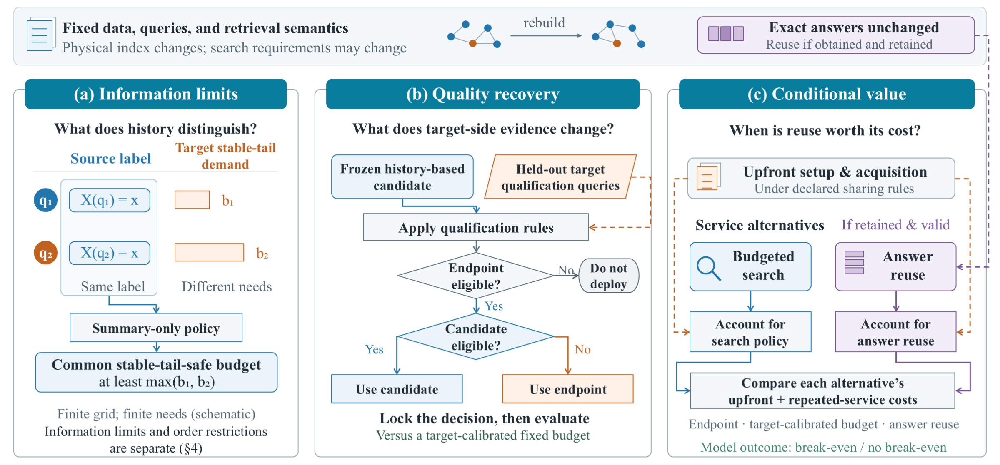

# Reading the research overview

[Project home](../README.md) · [Evidence map](../artifact/EVIDENCE.md) · [Runbook](../artifact/RUNBOOK.md)

The figure connects three research questions. It is a conceptual guide, not a measured graph topology, an executable pipeline, or a promise that each stage guarantees the next. The public response-analysis release covers selected supporting analyses, not every experiment depicted.

## A. Information limits

Two queries can share a source summary while having different target stable-tail demands. For a fixed target, recall threshold, and finite action grid, a summary-only deterministic policy must assign the same action to queries with the same summary. If both stable-tail demands are finite, a common stable-tail-safe budget must cover their maximum.

The orange target-demand bars illustrate a diagnostic constraint; they are **not inputs available to the source-summary-only policy**, and their lengths are schematic. A minimum safe budget is not necessarily the minimum measured cost. Information constraints and an additional order restriction are analyzed separately.

## B. Quality recovery

A frozen history-based candidate is checked using held-out target qualification queries. The branches summarize the declared deployment logic: an ineligible endpoint prevents deployment; otherwise the candidate is used if eligible, with the endpoint used as fallback. This logical ordering does not assert that statistical checks execute sequentially. Each method retains its own declared qualification rule.

The deployment decision is locked before evaluation. Recall-threshold failure rate, distance computations, and ANN API time describe different outcomes; a cost comparison alone does not establish matched quality. Target-calibrated fixed budgets provide a separate reference beyond the conservative endpoint.

## C. Conditional value

Each service alternative is accounted for separately, including its upfront setup/acquisition and repeated-service components. The branches compare alternatives; they do not add answer-reuse service cost to search service cost. Sharing rules and unmeasured **net** costs affect the resulting break-even boundary.

Answer reuse is a relevant alternative only when exact answers have been obtained, retained, and remain valid for the data and retrieval semantics. The fixed-data banner describes this setting; it does not assert validity after member or semantic changes. Conditional break-even is a model outcome, not an end-to-end deployment speedup.

## Visual conventions

Blue marks source summaries and search policies; orange marks target demands, qualification evidence, or acquisition inputs; purple marks valid answers and their reuse. Rectangles indicate processing/accounting, diamonds indicate deployment decisions, and the rounded termination shape indicates no deployment. Solid arrows show decision or accounting relationships; dashed arrows show additional evidence, available answers, or cost inputs.

The graphic is the approved manuscript overview, reused without redrawing. The [evidence map](../artifact/EVIDENCE.md) links its questions to available numerical materials.
